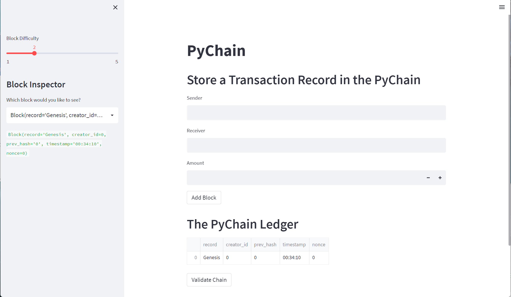

# Blockchain Demonstration with Streamlit
> A Streamlit application demonstration of a blockchain for sending/receiving financial transactions.


A functioning, single node blockchain running in your local environment.  Uses Streamlit for the UI and enables the following functionality:

1) Adding Records to the Blockchain.
2) Using a Proof of Work consensus with adjustable difficulty for adding blocks to the chain.
3) Verifying the blockchain by crawling blocks and verifying the hash records of adjacent blocks.
4) Inspecting individual block data.

---
## Technologies

The Block and Blockchain classes are constructed using ```Python 3.7.11```.  The web app and user interface is designed and powered by ```Streamlit 1.11.0```.

---

## Installation Guide

Before running the application, first install streamlit if you don't already have the package installed in your development environment.

```python
  pip install streamlit
```
.  All other imported packages used in this application are standard packages already included in the standard python and anaconda libraries.

---

## Usage

The pychain can be initialized by opening a terminal and navigating to the top directory of the repository.  The application can be initialized using streamlit by typing the following command:
```python
streamlit run pychain.py
```

.

Streamlit will initialize an instance of the application in your local environment and can be viewed in your default webbrowser.  Upon opening, the application window should look like the screenshot below:



Once itialized, notice a Genesis block, i.e. the first block, has already been created to initialize the chain.

A record can be added to the chain by entering the following fields:

* Sender
* Receiver
* Amount to Send

Once these amounts are entered, the transaction can be stored on the blockchain by clicking the ```Add Block``` button.  Some sample entries are added in the clip below:


To review individual blocks on the blockchain, the sidebar menu has a dropdown list where individual blocks can be selected and reviewed.  


To verify the hash record of the chain, click the ```Verify Chain``` button below the blockchain ledger.  If each block's hash record correctly matches the preceeding block's hash value, then the chain is valid and a green ```True``` will be displayed below the button.


## Data Sources

The seed code for this blockchain is provided by the course materials from a UCBerkeley Fintech Extension program.  

---

## Contributors

The seed code is from the course material from a UCBerkeley Extension program.  This blockchain and streamlit application is written by John Gruenewald.<br><br>
For more information, contact **John Gruenewald**:<br>
**e-mail:** [john.h.gruenewald@gmail.com](mailto:john.h.gruenewald@gmail.com)<br> **linked-in:**  [jhgruenewald](https://www.linkedin.com/in/jhgruenewald/)<br>**twitter:**  [@GruenewaldJohn](https://twitter.com/GruenewaldJohn)<br>**medium:**  [@comput99](https://medium.com/@comput99)

---

## License

MIT License

Copyright (c) 2022 John Gruenewald